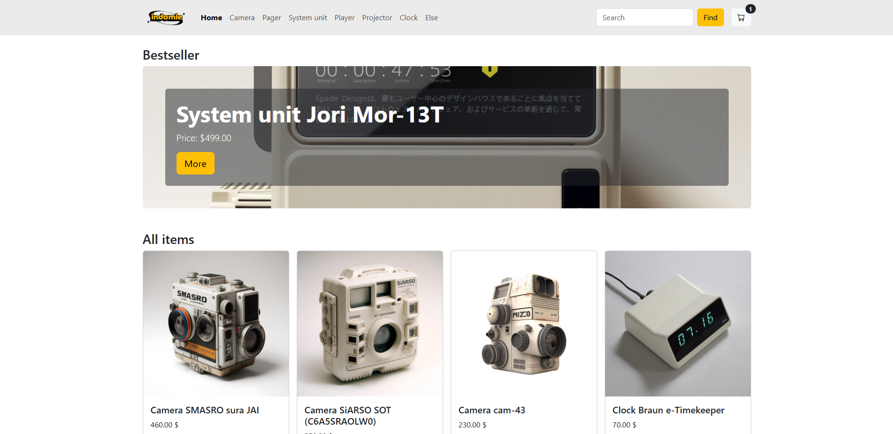
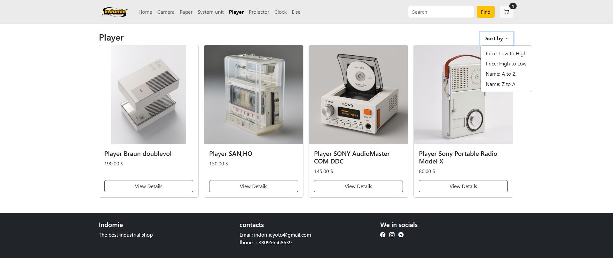
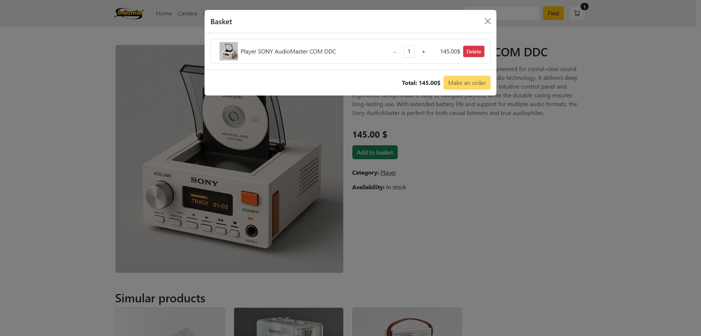

# Arcanum Shop

Simple online shop built with **Django 5**, featuring product catalog, categories, search, sorting, and cart.

## Features
- 📂 Categories and products
- 🔍 Search by name
- ↕️ Sorting (price, name)
- 🛒 Cart functionality
- 🖼️ Image upload with auto-cleanup

## 📸 Screenshots
### Home page

### Category page

### Product page

### Cart


## Technologies
- Django 5
- Bootstrap 5
- SQLite (default)

## Installation
1. Clone the repo:
```bash
   git clone https://github.com/yourname/django-shop.git
   cd django-shop
```

Create virtual environment:
```bash
python -m venv venv
source venv/bin/activate  # Linux/Mac
venv\Scripts\activate     # Windows
```

Install dependencies:
```bash
pip install -r requirements.txt
```

Run migrations:
```bash
python manage.py migrate
```

Start server:
```bash
python manage.py runserver
```